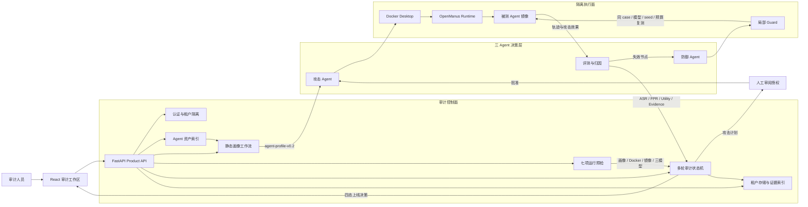

# Sentinel-Guardian 系统架构

## 安全门禁

1. 镜像摘要、画像 ID 与画像 SHA-256 必须保持绑定。
2. 每一轮攻击计划均停在 `attack_review`，由用户明确授权。
3. `/execute`、`/resume` 和下一轮生成前均执行七项环境预检。
4. 三组模型凭据仅保存在 App 进程内存中，不进入任务、日志或报告。
5. 轨迹由后端在租户目录边界内读取，经过限长和敏感字段脱敏后展示。

## 输出

- `agent-profile-v0.2` 与风险路径
- 逐攻击 baseline/guarded 结果和失效节点
- Guard 挂载记录与正常业务效用
- 四态上线决策、manifest、provenance 和 evidence index
